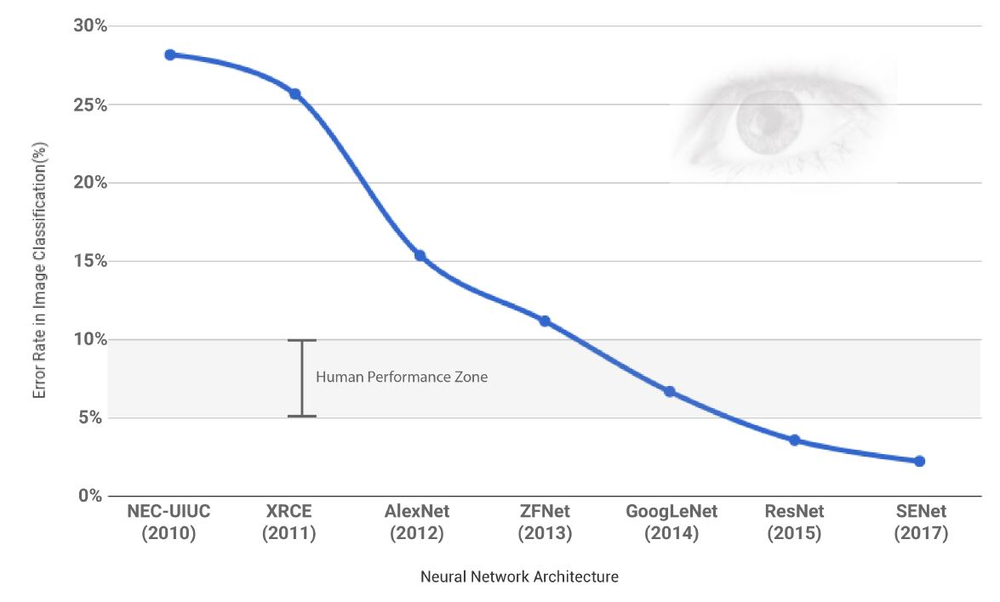

--- 
title: "Decision Analysis - Bayesian Networks"
author: "Author: Can Aytöre"
date: "Last Update: `r Sys.Date()`"
favicon: "favicon.jpg"
site: bookdown::bookdown_site
---

# Introduction

## Aim

## Motivation

- We have an understanding of BNs as graphical models representing probability distributions.
- What does that imply in terms of the underlying probability distribution?
- What happens if a probability distribution factorizes with respect to a graph?
- What kind of computations can we make on BNs?
- What kind of questions can we answer using (quantified) BNs?


# Decision Analysis


## Analytics

Analytics is:

- the discovery, interpretation, and communication of meaningful patterns in data (Wikipedia)
- the scientific process of transforming data into insight for making better decisions (INFORMS 2016)

Types of Analytics

- Descriptive: What is happening?
- Predictive: What will happen?
- Prescriptive: What should happen (when we do X)?

### Descriptive Analytics

- Extract information from data, summarise and report
- Shows the historical and current state of affairs
- Visualization is important and very valuable

### Predictive Analytics

- Extract information from data and use it to predict classification, trends and behavior patterns.
- Often the unknown event of interest is in the future, but predictive analytics can be applied to any type of unknown whether it be in the past, present or future.
- Reduces uncertainty
- Above a threshold, the accuracy of prediction can be a game changer!

#### Prediction Becomes more Accurate



#### Prediction Becomes Cheaper

- More accurate prediction is now used for traditional prediction tasks (e.g. forecasting weather or demand) and new problems (e.g. translation and navigation).
- The drop in cost of prediction has two main effects:
-- creates surprising externalities (e.g. music, video streaming, driving services)
-- increases the value of complements (data, judgement, and action)
- If Amazon can predict what consumers want more accurately, they can shift from a shop-then-ship to ship-then-shop strategy.


# Getting Started with ...

## What is BN?

A Probabilistic Network (aka causal graph, Bayesian belief network, etc.) is a graphical representation of a **joint probability distribution**.


## Running Example: "Is the Family Out?"

When Mr. West goes home at night, he wants to know if his family is home before trying the doors (maybe because the most convenient door to enter is double locked when nobody is home.) Often, when Mrs. West leaves the house, she turns on an outdoor light. However, she sometimes turns on this light if she is expecting a guest. Also (and of course!) the Wests have a dog. When nobody is home, the dog is put in the backyard. The same is true if the dog has bowel troubles. Finally, if the dog is in the backyard, Mr. West will probably hear her barking (or what he thinks is her barking), but sometimes he can be confused by other dogs barking.


```{r echo=TRUE, message=FALSE, warning=FALSE}
fo.data <- readRDS(url("https://github.com/canaytore/bayesian-networks/raw/main/data/fo_data.rds")) #fo.data is imported
head(fo.data)
```

```{r echo=TRUE, message=FALSE, warning=FALSE}
library(bnlearn)
library(gRain)
library(ggplot2)

fo.dag <- model2network("[F][B][L|F][D|F:B][H|D]") #Family-out network is created
graphviz.plot(fo.dag)
```

Each iteration results will be collected in following arrays.

```{r}
#First case: P(F=TRUE) 
first.mle <- array(dim = 20)
first.bayes <- array(dim = 20)

#Second case: P(D=OUT | B=YES, F=TRUE)
second.mle <- array(dim = 20)
second.bayes <- array(dim = 20)
```

Now that we have a model ( fo.dag ) and data ( fo.data ) 
We can learn the conditional probability tables (parameters) using the bn.fit function which implements the maximum likelihood maximization and a Bayesian method to learn parameters.

```{r}
for(i in 1:20){
  #P(F=TRUE) using mle:
  first.mle[i] <- bn.fit(fo.dag, fo.data[1:(500*i),])$F$prob["TRUE"]
  #P(F=TRUE) using bayes:
  first.bayes[i] <- bn.fit(fo.dag, fo.data[1:(500*i),], method = "bayes", iss=10)$F$prob["TRUE"]
  
  #P(D=OUT | B=YES, F=TRUE) using mle:
  second.mle[i] <- bn.fit(fo.dag, fo.data[1:(500*i),])$D$prob["OUT","YES","TRUE"]
  #P(D=OUT | B=YES, F=TRUE) using bayes:
  second.bayes[i] <- bn.fit(fo.dag, fo.data[1:(500*i),], method = "bayes", iss=10)$D$prob["OUT","YES","TRUE"] 
}
```

Plotting P(F=TRUE) using mle:

```{r}
first.mle #Each iteration results
first.mle <- as.data.frame(first.mle)
first.mle$ssize <- 1:20 # add iteration column
ggplot(first.mle, aes(ssize, first.mle)) + geom_line() + geom_hline(yintercept = 0.1566, color="red", size=1) + xlab("iteration") + ylab("P(F=TRUE) using MLE") + ylim(range(0.15,0.2))
```

Plotting P(F=TRUE) using bayes:

```{r}
first.bayes #Each iteration results
first.bayes <- as.data.frame(first.bayes)
first.bayes$ssize <- 1:20 # add iteration column
ggplot(first.bayes, aes(ssize, first.bayes)) + geom_line() + geom_hline(yintercept = 0.1569431, color="red", size=1) + xlab("iteration") + ylab("P(F=TRUE) using BAYES") + ylim(range(0.15,0.2))

```


Plotting P(F=TRUE) comparing both mle and bayes methods:

```{r}
plot(first.mle[,1], type="l", col="red", lwd = 2, xlab="iteration", ylab="P(F=TRUE)", ylim=range(0.15,0.20), main="Plotting both methods")
lines(first.bayes[,1], type="l", col="green", lwd = 2)
legend("topright", legend = c("MLE", "BAYES"), col = c("red","green"), bty='n', lty=1, lwd=2)
```

Plotting P(D=OUT | B=YES, F=TRUE) using mle:

```{r}
second.mle #Each iteration results
second.mle <- as.data.frame(second.mle)
second.mle$ssize <- 1:20 # add iteration column
ggplot(second.mle, aes(ssize, second.mle)) + geom_line() + geom_hline(yintercept = 1, color="red", size=1) + xlab("iteration") + ylab("P(D=OUT | B=YES, F=TRUE) using MLE") + ylim(range(0,1))
```

Plotting P(D=OUT | B=YES, F=TRUE) using bayes:

```{r}
second.bayes #Each iteration results
second.bayes <- as.data.frame(second.bayes)
second.bayes$ssize <- 1:20 # add iteration column
ggplot(second.bayes, aes(ssize, second.bayes)) + geom_line() + geom_hline(yintercept = 0.9324324, color="red", size=1) + xlab("iteration") + ylab("P(D=OUT | B=YES, F=TRUE) using BAYES") + ylim(range(0,1))
```

Plotting P(D=OUT | B=YES, F=TRUE) comparing both mle and bayes methods:

```{r}
plot(second.mle[,1], type="l", col="red", lwd = 2, xlab="iteration", ylab="P(D=OUT | B=YES, F=TRUE)", ylim=range(0.6,1), main="Plotting both methods")
lines(second.bayes[,1], type="l", col="green", lwd = 2)
legend("bottomright", legend = c("MLE", "BAYES"), col = c("red","green"), bty='n', lty=1, lwd=2)
```


# Influence Diagrams

An influence diagram is:
- a directed acyclic graph G containing decision and chance nodes, and information and relevance arcs representing what is known at the time of a decision and probabilistic dependency, respectively.
- a set of probability distributions associated with each chance node,
- optionally a utility node and a corresponding set of utilities

## Umbrella Problem

Consider the case when you are getting out of your apartment and you want to decide whether to take an umbrella with you or not. Your decision is certainly dependent on the weather, a phenomenon you cannot control. For simplicity, assume the weather can get one of the two states: sunshine or rain. You have likes and dislikes about taking your umbrella with you (you care!) depending on the weather. If it turns out to be a sunny day and you have taken your umbrella with you, you don’t like it. However, you would hate it more if it rains and you do not have your umbrella. You are happier if it is sunny and you have left your umbrella at home (do not need to carry it around). You are happiest if it rains and you have your umbrella with you.

```{r message=FALSE, warning=FALSE}
library(HydeNet)
umbrella.net <- HydeNetwork(~ payoff | action*weather)
```

For the chance node 'weather':

```{r message=FALSE, warning=FALSE}
weather_prob <- c(0.3, 0.7) #Prior probability for rain and sunshine, respectively.
umbrella.net <- setNode(umbrella.net, weather, nodeType="dcat", pi=vectorProbs(p=weather_prob, weather), factorLevels = c("rain","sunshine"), validate = FALSE)
```

For the decision nodes 'action':

```{r message=FALSE, warning=FALSE}
dprob <- c(1,0) #Probability of decision nodes represent do and don't.
umbrella.net <- setNode(umbrella.net, action, nodeType="dcat", pi=vectorProbs(p=dprob, action), factorLevels = c("take","leave"), validate = FALSE)
```

For the utility node 'payoff':

```{r message=FALSE, warning=FALSE}
umbrella.net <- setNode(umbrella.net, payoff, "determ", define=fromFormula(),
                  nodeFormula = payoff ~ ifelse(weather == "rain",
                                                      ifelse(action == "take", 100, 0),
                                                             ifelse(action == "take", 30, 70)))

umbrella.net <- setDecisionNodes(umbrella.net, action) #Setting the decision nodes
umbrella.net <- setUtilityNodes(umbrella.net, payoff) #Setting the utility nodes
plot(umbrella.net) #Plotting the influence diagram of extended version of oil-wildcatter problem
```

### Finding the optimal policy

Let us pass this structure to the Gibbs sampler (JAGS) and track the variables of interest (these nodes are useful to compute the conditional expectations if necessary).
Please note that the `rjags` package is just an interface to the JAGS library. Make sure you have installed JAGS-4.exe (can be downloaded from [here](http://www.sourceforge.net/projects/mcmc-jags/files))
We are trying to compute the expected utility of the policy: ('action').
`HydeNet` provides a policyMatrix() function to enumerate all policies of a given decision network. This decision network is solved using Gibbs sampling with 10^6 samples. We could use them as follows:

```{r message=FALSE, warning=FALSE}
policy_umbrella <- policyMatrix(umbrella.net)
compiledNet_umbrella <- compileDecisionModel(umbrella.net, policyMatrix = policy_umbrella)
trackedVars_umbrella <- c("weather","action","payoff")
samples_umbrella <- lapply(compiledNet_umbrella,
                     HydeSim,
                     variable.names = trackedVars_umbrella,
                     n.iter = 10^5)
```

Let us compute a single utility on samples:

```{r message=FALSE, warning=FALSE}
samples_umbrella <- lapply(samples_umbrella, function(x) 
  cbind(x, utility = x$payoff))
```

Now we can view all expectations at once by combining policies and the computed expectations:

```{r message=FALSE, warning=FALSE}
results_umbrella <- lapply(samples_umbrella, function(l) mean(l$utility))
results_umbrella <- as.data.frame(unlist(results_umbrella))
results_umbrella <- cbind(policy_umbrella, results_umbrella)
colnames(results_umbrella)[ncol(policy_umbrella)+1] <- "utility"
```

The results according policies are given below:

```{r message=FALSE, warning=FALSE}
results_umbrella[]
```

According to the policies, all utility values seem feasible and we don't have any conceptual error in the model.
The optimal policy seems to be:

```{r}
results_umbrella[results_umbrella$utility == max(results_umbrella$utility),] 
```
..the first policy which means DO the 'action', or TAKE the UMBRELLA which results in an expected reward of app. 51.2%. 

As extra information to be obtained from the output (to double check the validity of this model in this case),

Among the cases where it is decided not to ?drill? (3,4,7 and 8), it is sensible that the decision of not doing ?test? and not doing ?recovery? must be taken. It is clearly seen from result table. 
So when you do drill, you simply do not ?test?. The utility results can be seen from the following table:

```{r message=FALSE, warning=FALSE}
lapply(samples_umbrella, function(l) mean(l[l$weather=="rain",]$utility))
lapply(samples_umbrella, function(l) mean(l[l$weather=="sunshine",]$utility))
```


#### Evaluating Influence Diagrams: Augmented Variable Elimination

- *Barren node removal*: A barren node may be simply removed from an oriented, regular influence diagram. If it is a decision node, then any alternative would be optimal.
- *Chance node removal*: Given that chance node X directly precedes the value node and nothing else in an oriented, regular ID, node X can be removed by conditional expectation. Afterward, the value node inherits all of the conditional predecessors from node X, and thus the process creates no new barren nodes.
- *Decision node removal*: Given that all barren nodes have been removed, that decision node A is a conditional predecessor of the value node, and that all other conditional predecessors of the value node are informational predecessors of node A in an oriented, regular ID, node A may be removed by maximizing expected utility, conditioned on the values of its informational predecessors. The maximizing alternative(s) should be recorded as the optimal policy.
- *Arc reversal*: (between chance nodes). As we have seen before.


## Incorporating Weather Forecast

Consider the umbrella problem. Assume that you now decided to make a more **informed** decision. You listen to a weather forecast for that day. The new situation is depicted as:

```{r message=FALSE, warning=FALSE}
library(HydeNet)
umbrella2.net <- HydeNetwork(~ payoff | action*weather
                             + action | weather_forecast
                             + weather_forecast | weather)
```

For the chance node 'weather':

```{r message=FALSE, warning=FALSE}
weather_prob <- c(0.3,0.7) #Prior probability for rain and sunshine, respectively.
umbrella2.net <- setNode(umbrella2.net, weather, nodeType="dcat", pi=vectorProbs(p=weather_prob, weather), factorLevels = c("rain","sunshine"), validate = FALSE)
```

For the chance node 'weather_forecast':

```{r message=FALSE, warning=FALSE}
cpt_weather_forecast <- readRDS(url("https://github.com/canaytore/bayesian-networks/raw/main/data/cpt_weather_forecast.rds"))
#The file ?cpt_weather_forecast.rds? was created using the inputCPT() function of HydeNet. It stands for the conditional probability table of the seismic results based on parent nodes which are 'test' and 'oil_content'.
cpt_weather_forecast
umbrella2.net <- setNodeModels(umbrella2.net, cpt_weather_forecast)
```

For the decision nodes 'action':

```{r message=FALSE, warning=FALSE}
dprob <- c(1,0) #Probability of decision nodes represent do and don't.
umbrella2.net <- setNode(umbrella2.net, action, nodeType="dcat", pi=vectorProbs(p=dprob, action), factorLevels = c("take","leave"), validate = FALSE)
```

For the utility node 'payoff':

```{r message=FALSE, warning=FALSE}
umbrella2.net <- setNode(umbrella2.net, payoff, "determ", define=fromFormula(),
                  nodeFormula = payoff ~ ifelse(weather == "rain",
                                                      ifelse(action == "take", 100, 0),
                                                             ifelse(action == "take", 30, 70)))

umbrella2.net <- setDecisionNodes(umbrella2.net, action) #Setting the decision nodes
umbrella2.net <- setUtilityNodes(umbrella2.net, payoff) #Setting the utility nodes
plot(umbrella2.net) #Plotting the influence diagram of extended version of oil-wildcatter problem
```

### Finding the optimal policy

Let us pass this structure to the Gibbs sampler (JAGS) and track the variables of interest (these nodes are useful to compute the conditional expectations if necessary).
Please note that the `rjags` package is just an interface to the JAGS library. Make sure you have installed JAGS-4.exe (can be downloaded from [here](http://www.sourceforge.net/projects/mcmc-jags/files))
We are trying to compute the expected utility of the policy: ('action').
`HydeNet` provides a policyMatrix() function to enumerate all policies of a given decision network. This decision network is solved using Gibbs sampling with 10^6 samples. We could use them as follows:

```{r message=FALSE, warning=FALSE}
policy_umbrella2 <- policyMatrix(umbrella2.net)
compiledNet_umbrella2 <- compileDecisionModel(umbrella2.net, policyMatrix = policy_umbrella2)
trackedVars_umbrella2 <- c("weather","weather_forecast","action","payoff")
samples_umbrella2 <- lapply(compiledNet_umbrella2,
                     HydeSim,
                     variable.names = trackedVars_umbrella2,
                     n.iter = 10^5)
```

Let us compute a single utility on samples:

```{r message=FALSE, warning=FALSE}
samples_umbrella2 <- lapply(samples_umbrella2, function(x) 
  cbind(x, utility = x$payoff))
```

Now we can view all expectations at once by combining policies and the computed expectations:

```{r message=FALSE, warning=FALSE}
results_umbrella2 <- lapply(samples_umbrella2, function(l) mean(l$utility))
results_umbrella2 <- as.data.frame(unlist(results_umbrella2))
results_umbrella2 <- cbind(policy_umbrella2, results_umbrella2)
colnames(results_umbrella2)[ncol(policy_umbrella2)+1] <- "utility"
```

The results according policies are given below:

```{r message=FALSE, warning=FALSE}
results_umbrella2[]
```

According to the policies, all utility values seem feasible and we don't have any conceptual error in the model.
The optimal policy seems to be:

```{r message=FALSE, warning=FALSE}
results_umbrella2[results_umbrella2$utility == max(results_umbrella2$utility),] 
```
..the first policy which means DO the 'action', or TAKE the UMBRELLA which results in an expected reward of app. 51.2%. 

As extra information to be obtained from the output (also to double check the validity of this model in this case),

Among the cases where it is decided not to ?drill? (3,4,7 and 8), it is sensible that the decision of not doing ?test? and not doing ?recovery? must be taken. It is clearly seen from result table. 
So when you do drill, you simply do not ?test?. The utility results can be seen from the following table:

```{r message=FALSE, warning=FALSE}
lapply(samples_umbrella2, function(l) mean(l[l$weather_forecast=="sunny",]$utility))
lapply(samples_umbrella2, function(l) mean(l[l$weather_forecast=="rainy",]$utility))
lapply(samples_umbrella2, function(l) mean(l[l$weather_forecast=="cloudy",]$utility))
```

## Oil-Wildcatter Problem:

An oil wildcatter must decide whether to drill or not to drill. The cost of drilling is \$70,000. If he decides to drill, the well may be soaking (with a return of \$270,000), wet (with a return of \$120,000), or dry (with a return of \$0). These returns are exclusive of the drilling cost. The prior probabilities for soaking (lots of oil), wet (some oil), and dry (no oil) are (0.2, 0.3, 0.5). At the cost of $10,000, the oil wildcatter could decide to take seismic soundings of the geological structure at the site to classify the structure as having either no structure ns, open structure, os and closed structure cs. The specifics of the test are given as follows:


### Defining the extended network in HydeNet

Our first task will be to represent and solve the extended oil-wildcatter influence diagram using `HydeNet`. We generate the network in `HydeNet` as follows;

```{r message=FALSE, warning=FALSE}
library(HydeNet)
ow.net <- HydeNetwork(~ cost | test 
                      + drill | test*seismic_results 
                      + seismic_results | test*oil_content 
                      + reward | drill*oil_content)
```

For the chance node 'oil_content':

```{r message=FALSE, warning=FALSE}
oil_content_prob <- c(0.5, 0.3, 0.2) #Prior probability for dry, wet and soaking, respectively.
ow.net <- setNode(ow.net, oil_content, nodeType="dcat", pi=vectorProbs(p=oil_content_prob, oil_content), factorLevels = c("dry","wet","soak"), validate = FALSE)
```

For the decision nodes 'test' and 'drill':

```{r message=FALSE, warning=FALSE}
dprob <- c(1,0) #Probability of decision nodes represent do and don't.
ow.net <- setNode(ow.net, test, nodeType="dcat", pi=vectorProbs(p=dprob, test), factorLevels = c("test","dont_test"), validate = FALSE)
ow.net <- setNode(ow.net, drill, nodeType="dcat", pi=vectorProbs(p=dprob, drill), factorLevels = c("drill","dont_drill"), validate = FALSE)
```

For the chance node 'seismic_results':

```{r message=FALSE, warning=FALSE}
cpt_seismic_results <- readRDS(url("https://github.com/canaytore/bayesian-networks/raw/main/data/cpt_seismic_results.rds"))
#The file ?cpt_seismic_results.rds? was created using the inputCPT() function of HydeNet. It stands for the conditional probability table of the seismic results based on parent nodes which are 'test' and 'oil_content'.
cpt_seismic_results
ow.net <- setNodeModels(ow.net, cpt_seismic_results)
```

For the utility node 'cost':

```{r message=FALSE, warning=FALSE}
ow.net <- setNode(ow.net, cost, "determ", define=fromFormula(),
                  nodeFormula = cost ~ ifelse(test == "test", -10, 0))
```

For the utility node 'reward':

```{r message=FALSE, warning=FALSE}
ow.net <- setNode(ow.net, reward, "determ", define=fromFormula(),
                  nodeFormula = reward ~ ifelse(oil_content == "dry",
                                                      ifelse(drill == "drill", -70, 0),
                                                      ifelse(oil_content == "wet",
                                                             ifelse(drill == "drill", 50, 0),
                                                             ifelse(drill == "drill", 200, 0))))

ow.net <- setDecisionNodes(ow.net, test, drill) #Setting the decision nodes
ow.net <- setUtilityNodes(ow.net, cost, reward) #Setting the utility nodes
plot(ow.net) #Plotting the influence diagram of extended version of oil-wildcatter problem
```

The trick is here that we will have precise information about 'oil_content' after the decision 'drill'.
Besides, there must be an arc from ?drill? to ?recovery_level? since 'recovery_level' should exactly be nr (no recovery) when the drill is not done since it is not sensible to be able to do secondary 'recovery' without the primary 'drill'. 

### Finding the optimal policy

Let us pass this structure to the Gibbs sampler (JAGS) and track the variables of interest (these nodes are useful to compute the conditional expectations if necessary).
Please note that the `rjags` package is just an interface to the JAGS library. Make sure you have installed JAGS-4.exe (can be downloaded from [here](http://www.sourceforge.net/projects/mcmc-jags/files))
We are trying to compute the expected utility of the policy: ('action').
`HydeNet` provides a policyMatrix() function to enumerate all policies of a given decision network. This decision network is solved using Gibbs sampling with 10^6 samples. We could use them as follows:

```{r message=FALSE, warning=FALSE}
policy_ow <- policyMatrix(ow.net)
compiledNet_ow <- compileDecisionModel(ow.net, policyMatrix = policy_ow)
trackedVars_ow <- c("oil_content","seismic_results","test","cost","drill","reward")
samples_ow <- lapply(compiledNet_ow,
                     HydeSim,
                     variable.names = trackedVars_ow,
                     n.iter = 10^5)
```

Let us compute a single utility on samples:

```{r message=FALSE, warning=FALSE}
samples_ow <- lapply(samples_ow, function(x) 
  cbind(x, utility = x$reward + x$cost))
```

Now we can view all expectations at once by combining policies and the computed expectations:

```{r message=FALSE, warning=FALSE}
results_ow <- lapply(samples_ow, function(l) mean(l$utility))
results_ow <- as.data.frame(unlist(results_ow))
results_ow <- cbind(policy_ow, results_ow)
colnames(results_ow)[ncol(policy_ow)+1] <- "utility"
```

The results according policies are given below:

```{r message=FALSE, warning=FALSE}
results_ow[]
```

According to the policies, all utility values seem feasible and we don't have any conceptual error in the model.
The optimal policy seems to be:

```{r message=FALSE, warning=FALSE}
results_ow[results_ow$utility == max(results_ow$utility),] 
```
..the second policy which means DO NOT 'test', and DO 'drill' which results in an expected reward of app. 19868.3$. 

As extra information to be obtained from the output (also to double check the validity of this model in this case),

Among the cases where it is decided not to ?drill? (3,4,7 and 8), it is sensible that the decision of not doing ?test? and not doing ?recovery? must be taken. It is clearly seen from result table. 
So when you do drill, you simply do not ?test?. The utility results can be seen from the following table:

```{r message=FALSE, warning=FALSE}
lapply(samples_ow, function(l) mean(l[l$oil_content=="dry",]$utility))
lapply(samples_ow, function(l) mean(l[l$oil_content=="wet",]$utility))
lapply(samples_ow, function(l) mean(l[l$oil_content=="soak",]$utility))
```

```{r message=FALSE, warning=FALSE}
lapply(samples_ow, function(l) mean(l[l$seismic_results=="ns",]$utility))
lapply(samples_ow, function(l) mean(l[l$seismic_results=="os",]$utility))
lapply(samples_ow, function(l) mean(l[l$seismic_results=="cs",]$utility))
```


## Extended Oil-Wildcatter Problem:

Extend the Oil Wildcatter problem to include the following: After drilling, striking oil, and extracting an optimal amount using primary recovery techniques, the wildcatter has the option of ex- tracting more oil using secondary recovery techniques at an additional cost of \$20,000. Secondary recovery will result in no recovery (nr) with associated revenues of \$0, low recovery (lr) with associated revenues of \$30,000 or high recovery, (hr) with associated revenue of \$50,000. The amount of secondary recovery depends on the amount of oil as well. If the well is wet, the conditional probabilities of nr, lr, and hr are 0.5, 0.4 and 0.1, respectively. If the well is soaking, the corresponding probabilities are 0.3, 0.5, 0.2.

### Defining the extended network in HydeNet

Our first task will be to represent and solve the extended oil-wildcatter influence diagram using HydeNet. We generate the network in HydeNet as follows;

```{r message=FALSE, warning=FALSE}
library(HydeNet)
ow2.net <- HydeNetwork(~ cost | test 
                      + drill | test*seismic_results 
                      + seismic_results | test*oil_content 
                      + reward | drill*oil_content 
                      + recovery | drill*seismic_results
                      + extra_oil_content | oil_content
                      + recovery_reward | recovery*extra_oil_content)
```

For the chance node 'oil_content':

```{r message=FALSE, warning=FALSE}
oil_content_prob <- c(0.5,0.3,0.2) #Prior probability for dry, wet and soaking.
ow2.net <- setNode(ow2.net, oil_content, nodeType="dcat", pi=vectorProbs(p=oil_content_prob, oil_content), factorLevels = c("dry","wet","soak"), validate = FALSE)
```

For the decision nodes 'test', 'drill' and 'recovery':

```{r message=FALSE, warning=FALSE}
dprob <- c(1,0) #Probability of decision nodes represent do and don't.
ow2.net <- setNode(ow2.net, test, nodeType="dcat", pi=vectorProbs(p=dprob, test), factorLevels = c("test","dont_test"), validate = FALSE)
ow2.net <- setNode(ow2.net, drill, nodeType="dcat", pi=vectorProbs(p=dprob, drill), factorLevels = c("drill","dont_drill"), validate = FALSE)
ow2.net <- setNode(ow2.net, recovery, nodeType="dcat", pi=vectorProbs(p=dprob, recovery), factorLevels = c("recovery","dont_recovery"), validate = FALSE)
```

For the chance node 'seismic_results':

```{r message=FALSE, warning=FALSE}
cpt_seismic_results <- readRDS(url("https://github.com/canaytore/bayesian-networks/raw/main/data/cpt_seismic_results.rds"))
#The file ?cpt_seismic_results.rds? was created using the inputCPT() function of HydeNet. It stands for the conditional probability table of the seismic results based on parent nodes which are 'test' and 'oil_content'.
cpt_seismic_results
ow2.net <- setNodeModels(ow2.net, cpt_seismic_results)
```

For the chance node 'extra_oil_content':

```{r message=FALSE, warning=FALSE}
cpt_extra_oil_content <- readRDS(url("https://github.com/canaytore/bayesian-networks/raw/main/data/cpt_extra_oil_content.rds"))
#The file ?cpt_recovery_level.rds? was created using the inputCPT() function of HydeNet. It stands for the conditional probability table of the recovery levels based on parent nodes which are 'drill' and 'oil_content'.
#The trick here is that 'recovery_level' should exactly be nr (no recovery) when the drill is not done since it is not sensible to be able to do 'recovery' without the 'drill'.
cpt_extra_oil_content
ow2.net <- setNodeModels(ow2.net, cpt_extra_oil_content)
```

For the utility node 'cost':

```{r message=FALSE, warning=FALSE}
ow2.net <- setNode(ow2.net, cost, "determ", define=fromFormula(),
                  nodeFormula = cost ~ ifelse(test == "test", -10, 0))
```

For the utility node 'reward':

```{r message=FALSE, warning=FALSE}
ow2.net <- setNode(ow2.net, reward, "determ", define=fromFormula(),
                  nodeFormula = reward ~ ifelse(oil_content == "dry",
                                                      ifelse(drill == "drill", -70, 0),
                                                      ifelse(oil_content == "wet",
                                                             ifelse(drill == "drill", 50, 0),
                                                             ifelse(drill == "drill", 200, 0))))
```

For the utility node 'recovery_reward':

```{r message=FALSE, warning=FALSE}
ow2.net <- setNode(ow2.net, recovery_reward, "determ", define=fromFormula(),
                  nodeFormula = recovery_reward ~ ifelse(extra_oil_content == "nr",
                                                         ifelse(recovery == "recovery", -20, 0),
                                                         ifelse(extra_oil_content == "lr",
                                                                ifelse(recovery == "recovery", 10, 0),
                                                                ifelse(recovery == "recovery", 30, 0))))

ow2.net <- setDecisionNodes(ow2.net, test, drill, recovery) #Setting the decision nodes
ow2.net <- setUtilityNodes(ow2.net, cost, reward, recovery_reward) #Setting the utility nodes
plot(ow2.net) #Plotting the influence diagram of extended version of oil-wildcatter problem
```

The trick is here that we will have precise information about 'oil_content' after the decision 'drill'.
Besides, there must be an arc from ?drill? to ?recovery_level? since 'recovery_level' should exactly be nr (no recovery) when the drill is not done since it is not sensible to be able to do secondary 'recovery' without the primary 'drill'. 

### Finding the optimal policy

Let us pass this structure to the Gibbs sampler (JAGS) and track the variables of interest (these nodes are useful to compute the conditional expectations if necessary).
Please note that the `rjags` package is just an interface to the JAGS library. Make sure you have installed JAGS-4.exe (can be downloaded from [here](http://www.sourceforge.net/projects/mcmc-jags/files))
We are trying to compute the expected utility of the policy: ('action').
`HydeNet` provides a policyMatrix() function to enumerate all policies of a given decision network. This decision network is solved using Gibbs sampling with 10^6 samples. We could use them as follows:

```{r message=FALSE, warning=FALSE}
policy_ow2 <- policyMatrix(ow2.net)
compiledNet_ow2 <- compileDecisionModel(ow2.net, policyMatrix = policy_ow2)
trackedVars_ow2 <- c("oil_content","seismic_results","test","cost","drill","recovery","reward","extra_oil_content","recovery_reward")
samples_ow2 <- lapply(compiledNet_ow2,
                     HydeSim,
                     variable.names = trackedVars_ow2,
                     n.iter = 10^5)
```

Let us compute a single utility on samples:

```{r message=FALSE, warning=FALSE}
samples_ow2 <- lapply(samples_ow2, function(x) 
  cbind(x, utility = x$reward + x$cost + x$recovery_reward))
```

Now we can view all expectations at once by combining policies and the computed expectations:

```{r message=FALSE, warning=FALSE}
results_ow2 <- lapply(samples_ow2, function(l) mean(l$utility))
results_ow2 <- as.data.frame(unlist(results_ow2))
results_ow2 <- cbind(policy_ow2, results_ow2)
colnames(results_ow2)[ncol(policy_ow2)+1] <- "utility"
```

The results according policies are given below:

```{r message=FALSE, warning=FALSE}
results_ow2[]
```

According to the policies, all utility values seem feasible and we don't have any conceptual error in the model.
The optimal policy seems to be:

```{r message=FALSE, warning=FALSE}
results_ow2[results_ow2$utility == max(results_ow2$utility),] 
```
..the second policy which means DO NOT 'test', DO 'drill', and DO 'recovery' which results in an expected reward of app. 29254.8$. 

As extra information to be obtained from the output (also to double check the validity of this model in this case),

Among the cases where it is decided not to ?drill? (3,4,7 and 8), it is sensible that the decision of not doing ?test? and not doing ?recovery? must be taken. It is clearly seen from result table. 
So when you do drill, you simply do not ?test?. The utility results can be seen from the following table:

```{r message=FALSE, warning=FALSE}
lapply(samples_ow2, function(l) mean(l[l$oil_content=="dry",]$utility))
lapply(samples_ow2, function(l) mean(l[l$oil_content=="wet",]$utility))
lapply(samples_ow2, function(l) mean(l[l$oil_content=="soak",]$utility))
```

```{r message=FALSE, warning=FALSE}
lapply(samples_ow2, function(l) mean(l[l$seismic_results=="ns",]$utility))
lapply(samples_ow2, function(l) mean(l[l$seismic_results=="os",]$utility))
lapply(samples_ow2, function(l) mean(l[l$seismic_results=="cs",]$utility))
```

```{r message=FALSE, warning=FALSE}
lapply(samples_ow2, function(l) mean(l[l$extra_oil_content=="nr",]$utility))
lapply(samples_ow2, function(l) mean(l[l$extra_oil_content=="lr",]$utility))
lapply(samples_ow2, function(l) mean(l[l$extra_oil_content=="hr",]$utility))
```


# References {.unnumbered}

# Appendices {.unnumbered}

## About Author {.unnumbered}
